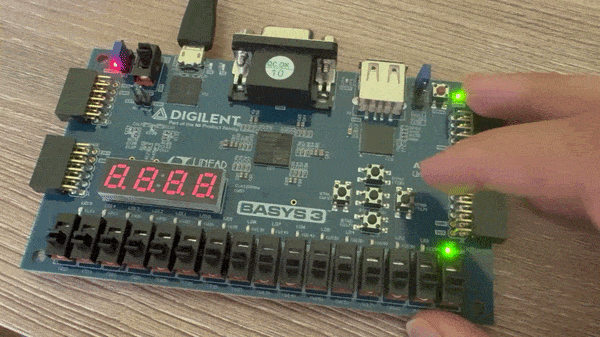

# 5-Stage Pipelined RV32I CPU Core

A 32-bit RISC-V processor core designed in SystemVerilog, synthesized and implemented on the Digilent Basys 3 FPGA (Artix-7). The core features a classic 5-stage pipeline architecture with explicit pipeline register isolation between stages, full hardware data forwarding, hazard detection with load-use stalling, and branch flush control handling.

---

## Hardware Demonstration (Security Vault State Machine)



*The processor executing an assembly-level security vault program loaded into instruction ROM. Inputs from the Basys 3 board switches and buttons are synchronized via `button_sync.sv`, processed through the CPU pipeline, and displayed on the onboard LEDs.*

### Demonstration Walkthrough
1. **System Reset & Initial Query:** The sequence begins with a full system reset. Querying the system via the top button with no switches set (`0`) returns 4 LEDs, confirming the vault is locked.
2. **Intermediate Access Checks:** Switches are toggled sequentially to test incorrect or partial passkeys (`2` -> `10`). Pressing the query button evaluates the input through the pipeline, maintaining the locked state (4 LEDs).
3. **Vault Unlock:** Setting the final correct passkey (`42`) and querying the system completes the authentication sequence, illuminating all 16 LEDs to signify a successful unlock.

---

## Microarchitecture & Pipeline Architecture

[ IF Stage ] ---> [ ID Stage ] ---> [ EX Stage ] ---> [ MEM Stage ] ---> [ WB Stage ]
      |                 |                 |                  |                 |
      |                 |                 +--- Forwarding ---+                 |
      +-------- Hazard Detection ---------+------------------------------------+

### 1. Explicit Pipeline Register Separation
The CPU enforces temporal and physical isolation between execution phases through synchronous pipeline registers updated on the rising clock edge:
- **IF/ID Register:** Buffers the 32-bit instruction fetched from `instruction_memory.sv` and the current Program Counter (PC).
- **ID/EX Register:** Buffers decoded control signals from `control_unit.sv`, operand values read from `register_file.sv`, sign-extended immediates, and operand register addresses (RS1, RS2, RD).
- **EX/MEM Register:** Buffers the computed ALU output from `alu.sv`, data write values for memory stores, destination register address (RD), and memory/writeback flags (`MemRead`, `MemWrite`, `RegWrite`, `MemtoReg`).
- **MEM/WB Register:** Holds memory read data from `data_memory.sv` and computed ALU results alongside write-back control lines.

### 2. Pipeline Execution Stages
- **Instruction Fetch (IF):** PC calculation via `pc.sv` with branch/jump target multiplexing; reads 32-bit instructions from `instruction_memory.sv`.
- **Instruction Decode (ID):** Decodes opcode and control signals via `control_unit.sv`; provides dual asynchronous read ports and synchronous write access to 31 general-purpose registers (`register_file.sv`, x0 hardwired to 0).
- **Execute (EX):** Performs arithmetic/logic operations via `alu.sv` and `alu_control.sv`, calculates branch targets, and resolves branch outcomes.
- **Memory Access (MEM):** Executes synchronous data load and store operations through `data_memory.sv`.
- **Write Back (WB):** Multiplexes between memory read data and ALU results to commit data back to the destination register in `register_file.sv`.

---

## Hazard Mitigation & Control Logic

- **Data Forwarding Unit (`forwarding_unit.sv`):** Resolves EX-hazard (`EX/MEM` -> `EX`) and MEM-hazard (`MEM/WB` -> `EX`) Read-After-Write (RAW) data dependencies. Bypasses execution results directly into the ALU operand inputs without incurring stall cycles.
- **Hazard Detection Unit (`hazard_detection_unit.sv`):** Detects Load-Use data hazards where an instruction depends on a value immediately loaded by the preceding instruction. Inserts a 1-cycle pipeline bubble by clearing `ID/EX` control signals while freezing the Program Counter (`pc.sv`) and `IF/ID` register.
- **Control Hazard Handling:** Evaluates branch decisions (`BEQ`) in the EX stage. If a branch is taken, flushes speculative instructions currently buffered in the `IF/ID` and `ID/EX` pipeline registers to protect architectural state integrity.

---

## Directory Structure

```text
├── constraints/
│   └── basys3_constraint.xdc      # Basys 3 FPGA pin mapping & clock constraints
├── firmware/
│   └── program.mem                # Vault lock state machine hex machine code
├── hardware-demo/
│   └── demo.gif                   # Physical FPGA execution capture
├── src/
│   ├── alu.sv                     # Arithmetic Logic Unit
│   ├── alu_control.sv             # ALU operation decoder
│   ├── basys3_module.sv           # FPGA top-level wrapper & clock divider
│   ├── button_sync.sv             # Button debouncer & input synchronizer
│   ├── control_unit.sv            # Main pipeline control decoder
│   ├── data_memory.sv             # Data RAM memory module
│   ├── forwarding_unit.sv         # EX/MEM & MEM/WB data hazard bypass unit
│   ├── full_wiring.sv             # Datapath interconnects & pipeline registers
│   ├── hazard_detection_unit.sv   # Load-use stall & pipeline freeze controller
│   ├── instruction_memory.sv      # Instruction ROM initialized with program.mem
│   ├── pc.sv                      # Program counter update logic
│   └── register_file.sv           # 32 x 32-bit dual-read register file
└── tb/                            # Verification testbenches
